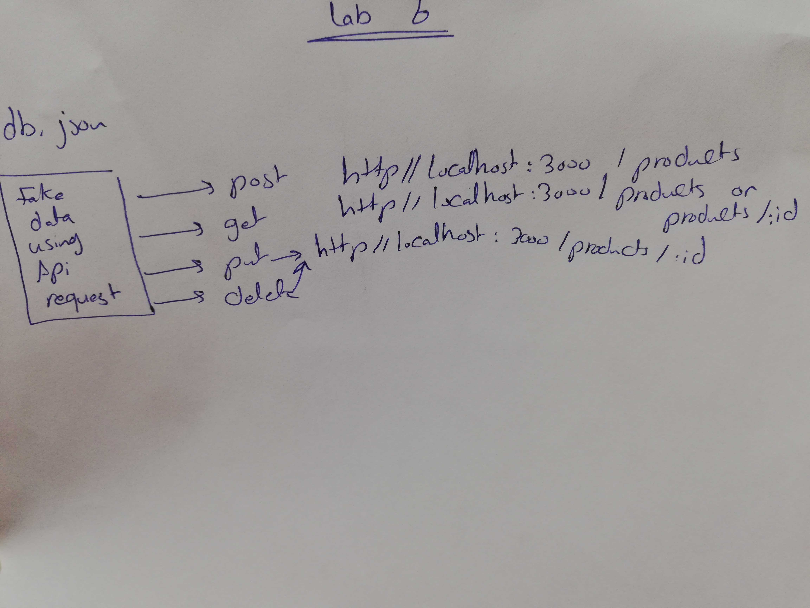
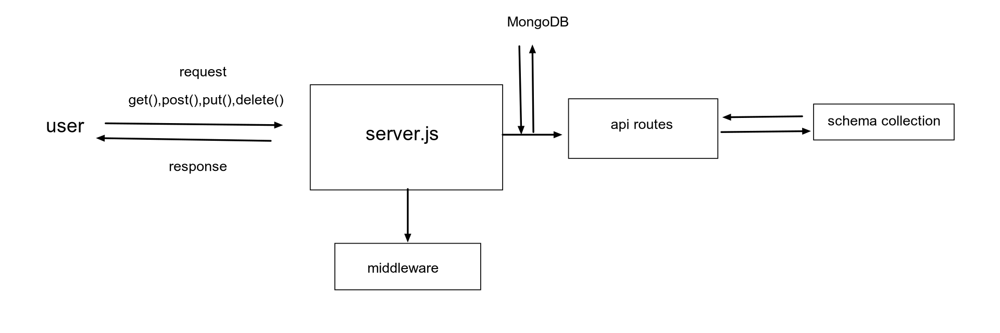

# api-server
an API that serves data for a virtual storefront, which displays categories and products to a potential shopper 

 ## Links and Resources
- swgger link : [swagger](https://app.swaggerhub.com/apis/SondosMatahen/swagger/0.)1]
 - [submission PR/lab-06 ](https://github.com/Reham-401-advanced-javascript/api-server/pull/5)
 

### Setup

- install json-server (npm i json-server)

 #### .env requirements (where applicable)
  i.e.

  `PORT - Port Number` :3000
  `MONGODB_URI` - URL to the running mongo instance/db

  ## How to initialize/run your application (where applicable)
   * ` json-server --watch ./data/db.json`

 

## UML

